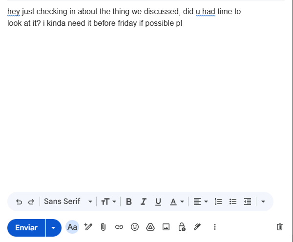
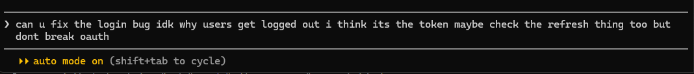
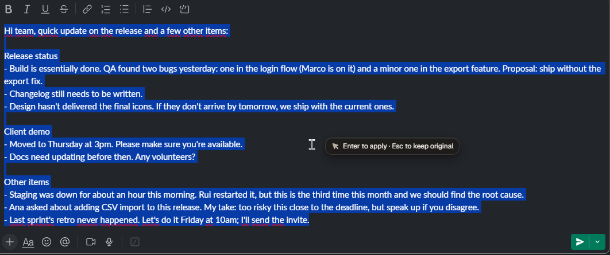
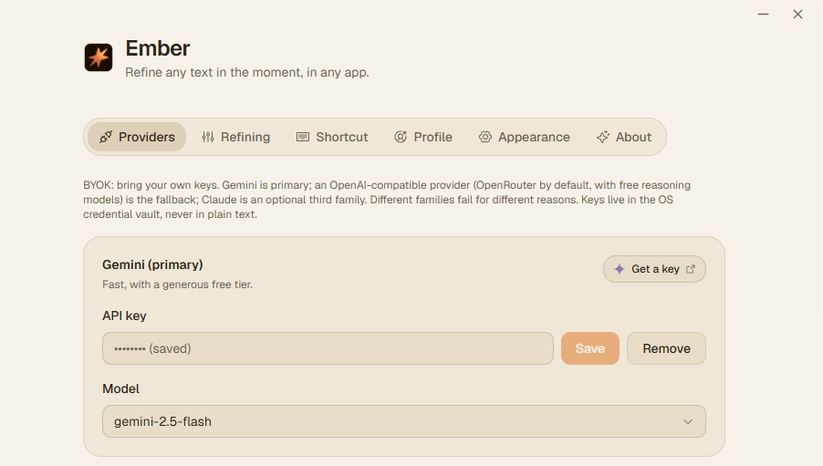
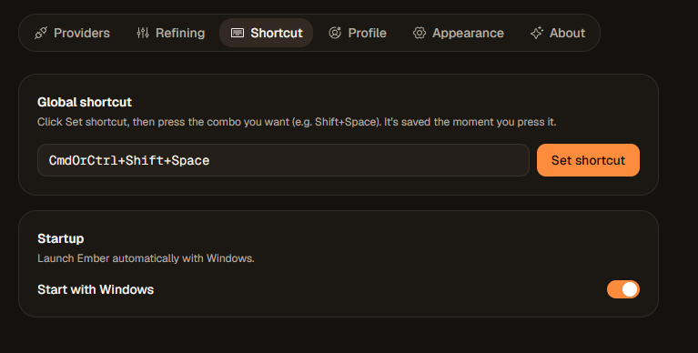

<p align="center">
  
</p>

<h1 align="center">Ember</h1>

<p align="center">
  <strong>Refine any text, in the moment, in any app.</strong><br>
  <em>Select text. Press a shortcut. Watch it sharpen in place.</em>
</p>

<p align="center">
  <a href="https://github.com/duartelcunha/Ember/releases/latest"></a>
  
  
  <a href="https://tauri.app/"></a>
  
  
  <a href="LICENSE"></a>
</p>

---

<p align="center">
  
</p>

You know that half-written email, that clumsy Slack message, that messy prompt
you keep rewording? Select it, press one shortcut, and Ember cleans it up right
where it sits, no chat window, no copy-paste, no losing your place.

It lives quietly in your system tray. Highlight text in **any** app, hit the
global shortcut, and a small orb appears by your cursor while it rewrites your
selection in place. Your clipboard is put back exactly as it was.

Not just for AI prompts, Ember sharpens **anything** you can select: emails,
messages, commit bodies, docs, terminal commands, in whatever language you wrote
it. Fix the grammar and clarity, or restructure the whole thing, three modes let
you dial how far it goes.

**No window switching. No copy-paste dance. No tab you forgot to close.**

<br>

## Why Ember

|  |  |
|---|---|
| ⚡ **Refine any text in place** | A global hotkey captures your selection, sharpens it, and pastes the result over the original, then quietly restores your clipboard. Prompts, emails, messages, commits, docs, terminal commands, anywhere you can select text. |
| 🧬 **Never mangles your text** | Before the model ever sees it, Ember masks your code, URLs, file paths, and placeholders, then verifies they came back **exactly** intact. If anything is lost or the output looks wrong, it degrades: your original selection stays untouched instead of getting overwritten with something broken. |
| ✋ **You get the last word** | Turn on **Confirm before pasting** and Ember shows a tiny prompt by your cursor after refining, applying only when you press Enter (Esc keeps your original). It captures the keys without stealing focus, so Enter never leaks into the app you're in. |
| 🆓 **Runs on free tiers** | Primary is Google **Gemini**, whose free tier covers everyday personal use. Fallback is any **OpenAI-compatible** endpoint, defaulting to **OpenRouter** with a free reasoning model (DeepSeek R1). Point it at DeepSeek, Groq, or a local Ollama with one field. |
| 🛡️ **Resilient, not fragile** | A pure retry/fallback state machine handles rate-limits, truncation, content-policy, and outages. Fallbacks are pre-validated at startup, never guessed at the moment of failure. It degrades honestly instead of silently. |
| 🔒 **BYOK, strictly local** | Your API keys live in the Windows Credential Manager, never in plain text, never anywhere but the provider. |
| 🎭 **Knows your project** | Optionally merges the `CLAUDE.md` / `AGENTS.md` / `GEMINI.md` of your focused project into the refine, with secret-shaped lines redacted. Off by default. |
| 💫 **Silky, deliberate UI** | A living mark that morphs from rough to refined and leans toward your cursor as it works. Compositor-only animations tuned for 120fps, a seamless frameless window, and a warm **Dark** or **Cream** theme. Respects your reduced-motion setting. |

<br>

## Quick start

1. Grab the latest installer from the [**Releases**](https://github.com/duartelcunha/Ember/releases/latest) page.
2. Launch Ember. It settles into your system tray.
3. Open **Settings** and drop in a free API key, [Gemini](https://aistudio.google.com/apikey) or [OpenRouter](https://openrouter.ai/keys) both have a free tier and take a minute to grab. *(Zero-key setup is on the [roadmap](#roadmap).)*
4. Select text anywhere and press `Ctrl+Shift+Space` (rebindable to any combo you like).
5. That's it, the polished version lands right where your text was.

> **Terminals are handled.** In Windows Terminal, PowerShell, and friends, Ember
> uses `Ctrl+Shift+C/V`, replaces the current input line instead of appending, and
> flattens the result to a single line so a stray newline never submits your command.

<p align="center">
  
  <br>
  <sub>A rough prompt in Claude Code's input line, refined in place.</sub>
</p>

<br>

## A closer look

**Confirm before pasting.** After refining, a small pill waits by your cursor:
Enter applies, Esc keeps your original. Nothing lands without your say-so.

<p align="center">
  
</p>

**Settings, in Cream or Dark.** Every provider card has a button that takes you
straight to where its key is created.

<p align="center">
  
  
</p>

<br>

## Moments

Ember animates the moments that matter, and only those. Every animation is
compositor-only (opacity + transform, no layout thrash), tuned for a smooth
120fps, and honors your OS reduced-motion setting.

| Moment | What you see |
|---|---|
| **Install** | The ember mark blooms in with a warm radial glow, the first-run welcome. |
| **Startup** | A quick, confident pulse of the mark each time Ember wakes. |
| **Refine** | The ember-star mark rides beside your cursor, a warm light sweeping across it as it works, leaning into your movement, then hands off to a glass pill with the result. |
| **Settings** | A frameless, seamless window that fades and scales in and hides on an instant, in **Dark** or **Cream**. |
| **Quit** | The mark dims and tilts away; the app exits exactly when the animation lands. |

<br>

## The refine chain

Ember tries providers in priority order, keeping only the ones you've configured:

```
Gemini  →  OpenAI-compatible (OpenRouter)  →  Claude
primary        default fallback              optional third family
```

Transient errors retry with backoff on the same provider; only on exhaustion does
it fall to the next family. Auth and truncation fall over immediately (the other
family has a different key and different limits). Non-transient errors (a bad
payload, a content-policy refusal) propagate without masking. Every branch of this
lives in `ember-core` as a pure, network-free, unit-tested function.

<br>

## Stack

- **Shell:** Tauri 2 (Rust) - clipboard, input simulation, tray, windows.
- **Frontend:** React 19, Vite 7, Tailwind CSS 4, Motion.
- **Core:** the `ember-core` crate holds the refine pipeline, selection
  sequencing, provider wire-formats, and the resilience state machine, fully
  unit-tested with no I/O.

The split is deliberate: everything that can be reasoned about is pure and tested;
the shell is a thin layer of I/O around it.

<br>

## Development

```bash
npm install          # dependencies
npm run tauri dev    # run in dev (tray app + hot reload)
```

Default shortcut: `Ctrl+Shift+Space`. Everything is tweakable from Settings.

**Tests** (the whole workspace, matching CI):

```bash
cargo test --workspace
```

<br>

## Roadmap

Ember works great today on free BYOK keys. Where it's headed:

- **Zero-setup by default.** The next big step is dropping the bring-your-own-key
  requirement, a built-in engine so Ember refines out of the box with nothing to
  configure, and BYOK becomes an option for power users, not a prerequisite.
- **A local, on-device mode.** Refine fully offline with a small local model, for
  when you want zero network and total privacy.
- **macOS.** The core is already ported; it needs CI, signing, and real testing.
- **Per-app tone.** Adapt the refine to where you are, a crisp shell command in a
  terminal, a warm message in a chat app, a formal email in your mail client.

<br>

## Versioning & updates

- `package.json` is the single source of truth for the version.
- Releases are cut by [release-please](https://github.com/googleapis/release-please)
  from [Conventional Commits](https://www.conventionalcommits.org/); merging the
  standing release PR tags and publishes signed installers.
- **Auto-update** is built in: Ember checks the latest signed GitHub release and
  updates in place.

<br>

## License

[MIT](LICENSE). The Ember name and logo are trademarks.

---
<p align="center"><sub>Better words, wherever you write them. 🔥</sub></p>
