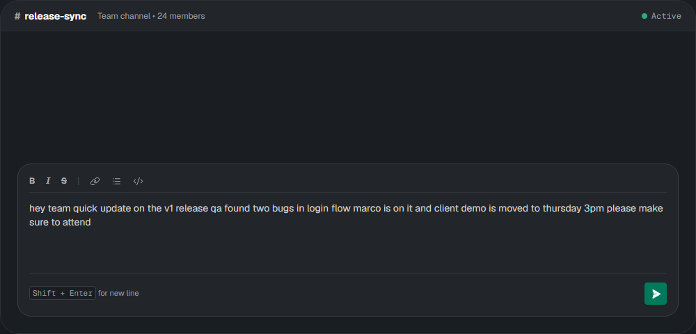
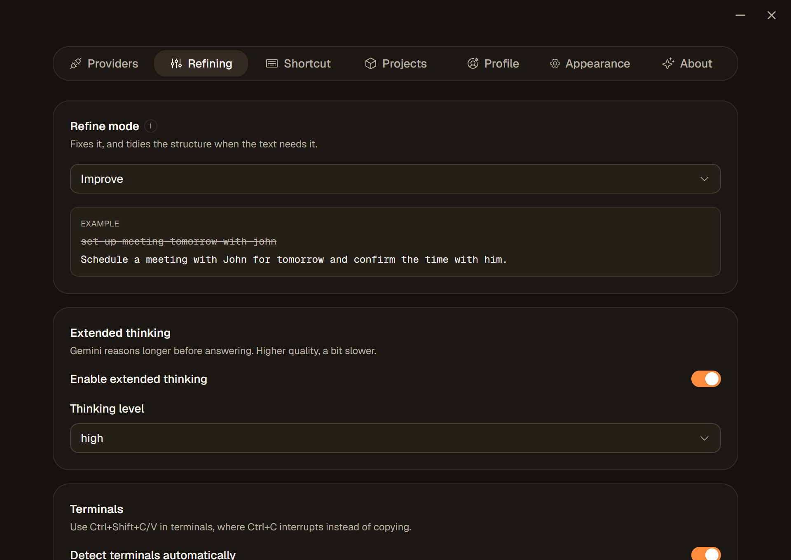
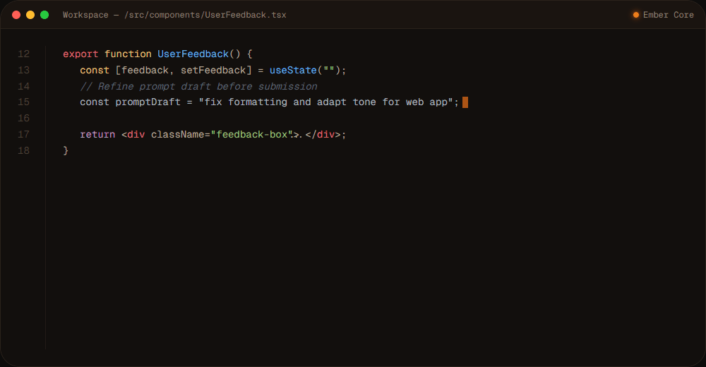
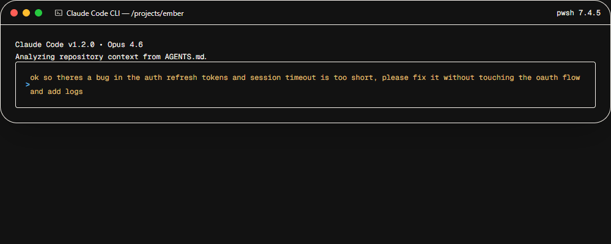
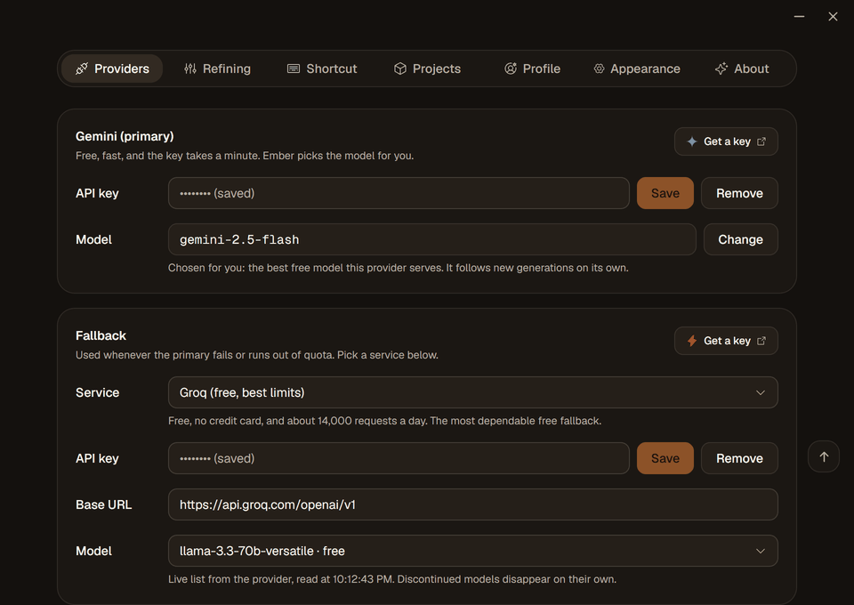

<p align="center">
  
</p>

<h1 align="center">Ember</h1>

<p align="center">
  <strong>Refine any text, in the moment, in any desktop app.</strong><br>
  <em>Select text. Press a global shortcut. Watch it sharpen in place.</em>
</p>

<p align="center">
  <a href="https://github.com/duartelcunha/Ember/releases/latest"></a>
  
  
  <a href="https://tauri.app/"></a>
  
  
  <a href="LICENSE"></a>
</p>

---

<p align="center">
  
</p>

You know that clumsy message, that rambling prompt you keep editing, or that rough commit note? Select it, hit your shortcut, and Ember cleans it up directly where your cursor is.

[Windows evaluation candidate 1.1.0-rc.2](https://github.com/duartelcunha/Ember/releases/tag/v1.1.0-rc.2) is available with a verified updater signature. Existing installations should use `/UPDATE` and preserve a configuration backup; do not run the old uninstaller first. See the [native test and installation evidence](docs/native-qualification.md).

The next [floating-surface and context changes](docs/floating-context-refinement.md) are under qualification. They introduce visible-pixel cursor anchoring, compact comparison cards and explicitly authorized project sources. They are not included in the published rc.2 installer.

This checkout is undergoing production hardening. Windows native qualification remains open; macOS and Linux do not yet meet the required functional parity. See the [implementation ledger and release blockers](docs/production-readiness.md). Historical recordings below do not establish the current native behavior.

---

## Precision Modes

Ember adapts its transformation engine according to your intent:

<p align="center">
  
</p>

- **Fix:** Corrects spelling, grammar, accents, and punctuation while strictly preserving structure and tone.
- **Improve:** Tightens phrasing, eliminates wordiness, and structures run-on thoughts into crisp bullet points.
- **Rebuild:** Transforms raw notes into an engineer-grade prompt complete with **Role**, **Context**, **Constraints**, and **Output Format**.

---

## Projects & Knowledge Context

Switch project-specific tone, guidelines, and vocabulary on the fly without polluting prompts or leaking private keys:

<p align="center">
  
</p>

- **Instant Hotkey Switcher:** Press <kbd>Ctrl+Shift+P</kbd> anywhere on your system to open a lightweight, cursor-anchored switcher and navigate between projects using arrow keys.
- **Distilled Rules:** Builds a reviewable brief from known Markdown sources and bounded local imports inside the selected directory. Source fingerprints identify stale briefs. Source data is redacted and framed; prompt injection remains a threat to evaluate.
- **Reviewed Global Profile:** Import explicitly selected `CLAUDE.md`, `AGENTS.md` or text files in Personalization, review the extracted preferences and technical facts, then save. Sources remain snapshots; Ember does not reload ambient agent files during refinement.
- **Custom Accents & Icons:** Dedicated colors and icons reflect active projects on the ambient orb and tray icon.

---

## Terminal & CLI Workflow

<p align="center">
  
</p>

Generic terminal replacement is disabled in this hardening checkout. The old clipboard fallback
and generic line-clearing shortcut were unsafe. Terminal capture can still obtain a result,
but safe replacement requires a tested adapter for the terminal and editor in use. The recording
above shows historical behavior. This limitation blocks the agreed production experience.

---

## Native Dark & Cream Themes

Ember blends natively with both dark and light desktop setups with instant theme switching:

<p align="center">
  
</p>

- **BYOK (Bring Your Own Key):** Direct links to create keys in 1 click for Gemini, Groq, OpenAI, OpenRouter, and Anthropic.
- **Interactive Hotkey Recorder:** Set custom shortcuts for Main refinement, direct Fix, direct Rebuild, and Project Picker.
- **Preview Gate (Optional):** Review changes in an unobtrusive bubble before applying (<kbd>Enter</kbd> to paste, <kbd>Esc</kbd> to keep original).
- **Smart Select-All Fallback:** When the focused editor exposes a verifiable editable field, pressing your shortcut with nothing selected can capture the whole field. Unsupported accessibility providers are refused.

---

## Security & Privacy Architecture

Results stay in memory by default. Optional retention uses authenticated encryption and a key in the OS vault. Legacy plaintext results are preserved without being loaded and can be explicitly deleted in Settings. Diagnostic prompt logging is a separate opt-in plaintext setting. See [data handling and recovery](docs/data-policy.md).

| Area | Current implementation |
|---|---|
| **Secret Storage** | API keys and OAuth refresh credentials use the OS Credential Vault (**Windows Credential Manager** / macOS Keychain). Active access tokens remain in memory. Keys never cross the IPC bridge to frontend JavaScript. |
| **Prompt Boundary Isolation** | Input text and project context are wrapped with strict anti-injection delimiters and escaped (`[EMBER_INPUT]`, `[EMBER_PROJECT_SOURCE]`, `[EMBER_PROJECT_CONTEXT]`). |
| **Window & Focus Isolation** | Overlay and Picker windows run with `focus: false` and strict Content Security Policy (`default-src 'self'`). Windows replacement checks the original window, focused HWND, accessibility element, selection endpoints and recaptured text. Native application qualification and continuous input generation validation remain open. |
| **Input Hook Hygiene** | Low-level keyboard hooks (`WH_KEYBOARD_LL`) own confirmation and paging keys during preview gates and pass all other system keystrokes through untouched. |
| **Link opening** | Browser links and URLs are opened directly via Win32 `ShellExecuteW`, bypassing `cmd.exe` execution layers. |

---

## The Refine Fallback Chain

```text
[ Primary Provider ]               [ Fallback Provider ]
 Google Gemini Free Tier   ───►   OpenAI-Compatible over HTTPS (Groq / OpenRouter)
```

- **Resilient State Machine:** Transient network errors and rate limits (`429`) automatically trigger exponential backoff according to `Retry-After` headers.
- **Free-Tier First:** Runs out-of-the-box on Google **Gemini** (generous free tier) with automatic fallback to **Groq** (free OpenAI-compatible endpoint, ~14,000 requests/day).
- **Clean Degradation:** If all configured providers fail, your original text remains intact on the clipboard and an unobtrusive notification is displayed.

---

## Quick Start

1. Download the installer from [**Releases**](https://github.com/duartelcunha/Ember/releases/latest).
2. Launch Ember (it minimizes to your system tray).
3. Open **Settings** (<kbd>Tray Icon</kbd> → **Settings**) and paste a free API key:
   - [Google AI Studio (Gemini)](https://aistudio.google.com/apikey)
   - [Groq Cloud](https://console.groq.com/keys)
4. Highlight any text in any application and press your global shortcut (configured on first launch).

---

## Development

### Prerequisites
- Node.js (LTS) & npm
- Rust stable (`rustup default stable`)
- Tauri v2 prerequisites for Windows / macOS

### Build & Run
```bash
# Install frontend dependencies
npm install

# Run in development mode (with HMR)
npm run tauri dev

# Run full test suite (matching CI)
cargo test --workspace

# Typecheck and bundle production release
npm run build
```

---

## License

Distributed under the [MIT License](LICENSE).
